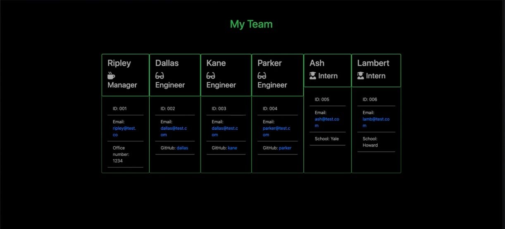

# Team Profile Generator

## 

## Table of Contents:

- [Description](#description)
- [Installation](#installation)
- [Usage](#usage)
- [Contributing](#contributing)
- [Credits](#credits)
- [Tests](#tests)
- [License](#license)
- [Questions](#questions)

## Technologies Used:

- Bootstrap,CSS3,HTML5,JavaScript,JQuery,Node.js

## Description

This application receives information about employees on a software engineering team, then generates and HTML webpage that displays summaries for each person.

## Installation

npm install

## Usage

## Link to video

This is a link to a walkthrough video that demonstartes the apps functionality. (https://drive.google.com/file/d/1YZzkHnVPpI0VicerN0o0bY0mV1zw9K7q/view)

- Fork the Project (https://github.com/norrinRadd8/team-profile-generator.git)
- Create your Feature Branch (git checkout -b feature/AmazingFeature)
- Commit your Changes (git commit -m 'Add some AmazingFeature')
- Push to the Branch (git push origin feature/AmazingFeature)
- Open a Pull Request"

## Tests

npm run test

## License

This project is covered under the  license.

## Questions

Any questions please email me - halw@test.com

My GitHub Link is - https://github.com/norrinRadd8
